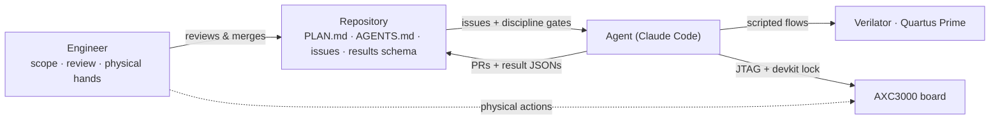

# CoreDLA on the Arrow AXC3000 — measured inference

Measured performance of the Altera FPGA AI Suite **CoreDLA** inference IP on the ~$129 Arrow
**AXC3000** board — an **Agilex 3** `A3CY100BM16AE7S` (no HPS, **no DDR**).

This page reports **only measured silicon results** for one workload: `resnet8-cifar10` INT8.

## Result — `resnet8-cifar10` INT8 (MLPerf Tiny image classification)

Current best (2026-08-22): a **Nios-less** CoreDLA `k16/c8` design with the full 205,056-byte
config+filter parameter image resident in on-chip RAM (no external memory in the inference path),
`dla_clk` at the die's practical ceiling.

| Metric | Measured |
|---|---|
| **Top-1 accuracy** | **86.33 %** on the **full 10,000-image** CIFAR-10 test set (95 % CI 85.66–87.00) — vs the 86.5 % MLPerf Tiny reference-model figure and the 85 % closed-division floor |
| **CoreDLA engine throughput** | **2,178.4 fps** single-stream at `dla_clk` = **340 MHz**; 2,270.7 fps pipelined at descriptor-queue depth ≥ 8 |
| Engine latency | 459.05 µs p50 — device time from the jobs_active-gated `CLOCKS_ACTIVE` CSR; JTAG transfer excluded by construction |
| **Fmax** | **342.94 MHz** Quartus Restricted Fmax — Minimum-Pulse-Width-limited on this `-E7S` speed grade; the 340 MHz build closes with `dla_clk` setup +0.157 ns and MPW +0.025 ns (a 375 MHz fit met setup/hold but failed MPW and was rejected) |
| Compute efficiency | 6.41 fps/MHz |

Two records back this row, built from the same architecture with **bit-identical logits** on the
official 200-image `ic01` subset:

- [`results/ph4_resnet8-cifar10-niosless-jtag-340mhz_20260822.json`](results/ph4_resnet8-cifar10-niosless-jtag-340mhz_20260822.json)
  — the 340 MHz speed record (bitstream SHA-256 `d983a0fa…`; 84.00 % on the 200-image subset,
  statistically consistent with the full-set figure at n=200).
- [`results/ph4_resnet8-cifar10-niosless-jtag-full10k_20260822.json`](results/ph4_resnet8-cifar10-niosless-jtag-full10k_20260822.json)
  — the full-10k accuracy record at the 300 MHz rung (1,895.5 fps, deterministic 527.57 µs latency,
  bitstream SHA-256 `d16828ff…`).

> **These are engine rates** (on-chip CSR cycle counts, descriptor-fetch → feature-writer-done).
> End-to-end system throughput remains host-JTAG-bound (~57 img/s including JTAG input writes) —
> a data-delivery limitation, not an engine one. Evaluation (unlicensed) CoreDLA IP with its
> 10,000-inference cap; the full-10k run used two programming cycles. **Not an official MLPerf
> Tiny submission.**

## System configuration — current best (Nios-less, on-chip parameters)

| | |
|---|---|
| Device | Altera **Agilex 3** `A3CY100BM16AE7S` (Arrow AXC3000, no HPS) |
| CoreDLA architecture | [`models/arch/resnet8_agx3_int8_k16c8.arch`](models/arch/resnet8_agx3_int8_k16c8.arch) — vendor `AGX3_Performance` option set at `k_vector`/`c_vector` = 16/8: 128 INT8 MACs/cycle, FP12AGX block floating point, DSP tensor mode `TENSOR1X2_MULT8` |
| **CoreDLA compute clock** (`dla_clk`) | **340.000 MHz** (accuracy rung: 300 MHz) — IOPLL VCO 1700 MHz, M=68, C0=13, C1=5 |
| `ddr_clk` / CSR / interconnect | 130.769 MHz at the 340 rung (100 MHz at the accuracy rung) |
| Parameters | 205,056 B config+filter image MIF-baked into on-chip "pseudo-DDR" RAM on the DLA's `ddr_axi` master, FNV-1a-verified by JTAG readback every programming cycle — **no HyperRAM, no soft CPU** |
| Host | none on chip — the host PC drives a JTAG-to-Avalon master via System Console |
| Model | MLPerf Tiny pretrained INT8 TFLite `pretrainedResnet_quant.tflite` (pinned `mlcommons/tiny`), no-Softmax adapted graph |
| Quantization | int8-tflite-mlperf-pretrained |

Clock-scaling evidence: the same design closed timing and passed the identical board gate at 100,
200 (achieved Fmax 235.79 MHz), 225 (247.10), 300 (312.50/330.36) and 340 MHz (342.94), with
bit-identical FP16 logit codes across every rung. DLA job time fits
`ticks(f) = 141,840/f_dla_MHz + fixed` — ~98 % of the job scales with the core clock; the measured
205 KB per-job parameter re-fetch is only ~6 % of the job. See
[`docs/fpga_ai_speed_hunt_2026-08-21.md`](docs/fpga_ai_speed_hunt_2026-08-21.md) and
[`docs/fpga_ai_clock_scaling_2026-08-21.md`](docs/fpga_ai_clock_scaling_2026-08-21.md).

## Toolchain

| Tool | Version |
|---|---|
| Quartus Prime Pro | 26.1.0 Build 110 (Agilex 3) |
| FPGA AI Suite | 2026.1.1 (`dla_compiler` 2026.1.1+b17) |
| OpenVINO runtime | 2025.4.0 (CPU oracle only; not in the deploy loop) |
| Flow | native Windows (PH4 records); `alterafpga/fpgaaisuite:2026.1.1-quartus` container (PH3 record) |

## FPGA resource usage — Nios-less k16/c8 design (`A3CY100BM16AE7S`)

| Resource | Used | Available | % |
|---|---:|---:|---:|
| Logic (ALMs) | 24,024 | 34,000 | **71 %** |
| M20K blocks | 254 | 262 | **97 %** |
| DSP blocks | 24 | 276 | 9 % |

The design is **M20K-bound** (97 %) — on-chip parameter storage plus CoreDLA buffering consumes
nearly every block RAM; the 2× `k16/c16` core (256 MACs/cycle) fits only via the defective
`enable_on_chip_parameters` mode (input-invariant output — see
[`docs/fpga_ai_streaming_egress_escalation.md`](docs/fpga_ai_streaming_egress_escalation.md)) and
with working DDR-served parameters would need ~275 M20K. Remaining headroom on this die is
blocked, not unexplored.

## Prior result — HyperRAM-fed CoreDLA (2026-07-11)

The first measured silicon result streamed weights from the board's 16 MB HyperRAM every inference:
**409.3 fps** engine rate at `clk_dla` = 200 MHz (2.05 fps/MHz), **86.0 %** top-1 on 100 CIFAR-10
test images vs the 86.64 % CPU-INT8 reference, `AGX3_Performance.arch` INT8 (NNCF PTQ) at
32,889 ALMs (97 %) / 228 M20K (87 %) / 75 DSPs. Full record:
[`results/ph3_resnet8-cifar10-hyperram-onboard_20260711.json`](results/ph3_resnet8-cifar10-hyperram-onboard_20260711.json)
(bitstream SHA-256 `e0e363f2…`). The board limitations below were characterized on that design and
apply to any HyperRAM-fed configuration.

## HyperRAM-related board limitations

CoreDLA is architected for a wide, high-bandwidth DDR global memory. The AXC3000 has none — that one
gap drives every limitation here:

- **No DDR.** Only a 16 MB HyperRAM on an **8-bit** HyperBus (the vendor Agilex-3 devkit ships LPDDR4).
  Peak HyperRAM bandwidth is ~350 MB/s (175 MHz CK × DDR × x8) versus DDR-class GB/s, so the design is
  **memory-bandwidth-constrained** — resnet8 re-streams its weights from HyperRAM every inference.
- **16 MB capacity** caps the resident config + weights + activation working set.
- **`clk_dla` = 200 MHz, not 600.** The vendor default engine clock fails STA by a wide margin on this
  fit; 200 MHz is what closes.
- **DDIO write defect (worked around).** The HyperRAM DDIO controller corrupts any 32-byte beat written
  more than once (the device "write-wound" law). Fixed on our side by a **write-combiner** in the
  AXI→HyperBus bridge ([`rtl/hyperbus/axi4_hbmc_bridge.sv`](rtl/hyperbus/axi4_hbmc_bridge.sv)) that
  gathers the host's per-word partial writes into one full-strobe beat write — making the contiguous
  config/weight load bit-exact. The memory-IP track root-caused it to a missing CK eye-centring pin
  delay (`set_instance_assignment -name D5_DELAY 15 -to hb_ck`), tracked for a margin fix.
- **Per-fit launch calibration.** The DQ/CK pad-launch timing is trim-calibrated per fit and *not*
  SDC-constrained, so a fit can pass STA yet be silicon-marginal — every rebuild must be
  silicon-validated (shape suite: `wstrb_abc.tcl` + `wound_retest.tcl`).
- **JTAG data path (bring-up).** Config/weights/input are delivered over JTAG (~1–2 MB/s, control-plane
  rate), which bounds end-to-end system throughput to ~12 fps. The DLA engine rate (409 fps) is
  unaffected; a HyperRAM-resident input feed is the next step.
- **JTAG programming quirk.** This cable must configure at **6 MHz** JtagClock — 15 MHz silently fails
  to synchronize.

Remaining follow-ups (D5_DELAY margin fix, full-set accuracy, on-chip `hw_timer` timing, the other
MLPerf Tiny models) are tracked in **issue #71**.

## How this repo was built

Nearly everything here — RTL, testbenches, scripts, Quartus projects, silicon debug, and these docs —
was produced by an AI agent (Claude Code) working the issue roadmap under the rules in
[`AGENTS.md`](AGENTS.md), with one engineer reviewing every PR and handling the physical board.
The PH4 Nios-less records were produced by a second, independent AI-agent campaign in a separate
native-Windows workspace against the same board and pinned MLCommons sources; its result JSONs,
architecture file, and the four supporting reports under `docs/fpga_ai_*` were imported here
verbatim (paths rebased to this repo).
Write-ups on fpgapa.org:

- **Case study:** [End-to-end FPGA development with Claude](https://fpgapa.org/blog/end-to-end-fpga-development-with-claude.html)
  — empty repo to measured on-silicon inference in eight days, every number linked to its JSON in `results/`.
- **How-to:** [How to run an AI agent on FPGA work](https://fpgapa.org/blog/ai-agent-fpga-how-to.html)
  — the setup steps and an honest ladder of the complexity levels demonstrated here.

## Reference

- **MLPerf Tiny v1.4** results (MLCommons): <https://mlcommons.org/benchmarks/inference-tiny/>
- resnet8-cifar10 reference model: <https://github.com/mlcommons/tiny> (`pretrainedResnet.tflite`)

## License

MIT — see [`LICENSE`](LICENSE). The [`third_party/hyperram`](https://github.com/fpga-professional-association/hyperram)
submodule and the reference models/datasets fetched by `sw/model_prep/` carry their own licenses.

---

Multiple agents share one board — any on-board work must hold the
[`scripts/devkit_lock.sh`](scripts/devkit_lock.sh) devkit lock.
