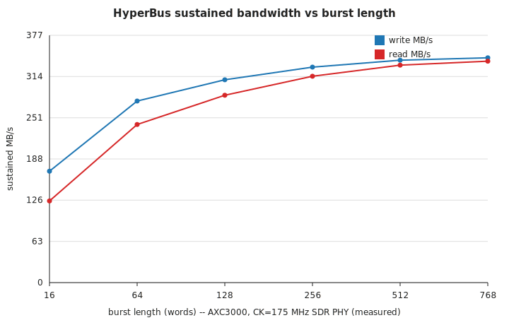

# HyperBus sustained bandwidth vs burst length (PH3)

Generated from the six `results/ph3_hyperbus_bw_len*.json` result files (`kind: measured`,
`level: PH3`, `config.fclk_mhz: 175`). Parse them with `results/reports/plot_hyperbus_bw.py`
(also renders the plot below) — the numbers in this section are not hand-typed; re-run that
script whenever the JSONs change and diff the table.

## Provenance

- **Hardware:** physical Arrow AXC3000 (A3CY100BM16AE7S + Winbond W957D8NB HyperRAM), measured
  2026-07-09.
- **RTL:** `third_party/hyperram` submodule @ `c6f5d2b`, bandwidth-engine bitstream `bw.sof`
  (`bitstream_sha256: 8328e85b4e4e88121bab3fd3a91c7f550029a3f31ddc31fe436e3e452a99aa7d` in every
  result JSON), Quartus 26.1.0 Build 110.
- **PHY:** SDR (single-data-rate) HyperBus PHY, `CK = 175 MHz` (byte clock 350 MHz).
- **Control plane:** USB-Blaster III JTAG for load/trigger/readback only — the reported MB/s times
  the on-chip Avalon datapath counters, not the JTAG link (PLAN §8 method E: JTAG is not a data
  plane in anything performance-measured).
- **Integrity:** every run reports `ERR_COUNT=0` / `RESULT=PASS` (bit-exact write/read-back compare
  over the whole burst).

## Measured table

| burst (words) | WRITE MB/s | READ MB/s | wr cycles | rd cycles | fixed overhead (wr / rd) |
|---:|---:|---:|---:|---:|---:|
| 16  | 169.70 | 124.44 | 33  | 45  | 17 / 29 |
| 64  | 276.54 | 240.86 | 81  | 93  | 17 / 29 |
| 128 | 308.97 | 285.35 | 145 | 157 | 17 / 29 |
| 256 | 328.21 | 314.39 | 273 | 285 | 17 / 29 |
| 512 | 338.75 | 331.24 | 529 | 541 | 17 / 29 |
| 768 | **342.42** | **337.26** | 785 | 797 | 17 / 29 |

`wr cycles - burst_words` and `rd cycles - burst_words` are constant across every point (17 and 29
clocks respectively) — see the "scaling" interpretation below.

## Burst-length scaling: fixed overhead amortizing

Every burst pays a fixed command/address (CA) + latency-count overhead before the data phase
starts, independent of burst length:

- **Write:** `wr_cycles = burst_words + 17` at every one of the six points (33−16, 81−64, 145−128,
  273−256, 529−512, 785−768 all equal 17).
- **Read:** `rd_cycles = burst_words + 29` at every one of the six points (same check, all equal
  29). Reads carry the extra ~12 clocks of HyperRAM access latency (RWDS-qualified turnaround)
  that writes don't.

Because the overhead is additive and constant while the data phase is proportional to
`burst_words`, throughput follows `MB/s(n) = 2 * n / (n + overhead) * byte_clock_bytes_per_cycle`-shaped
saturation: short bursts (16 words) pay a ~50%+ tax on write and a much larger fraction on read
(29/45 = 64% of the cycles at len=16 are overhead, vs 29/797 = 3.6% at len=768) — this is exactly
why write/read start far apart (169.70 vs 124.44 MB/s, a 45.26 MB/s gap) and converge as length
grows (342.42 vs 337.26 MB/s, a 5.16 MB/s gap at len=768). The curve is a textbook fixed-latency
amortization curve, not a PHY-bandwidth change — the underlying byte rate per data cycle is
constant across the sweep.

## Peak = the SDR PHY ceiling on this board, not the device ceiling

342.42 MB/s (write) / 337.26 MB/s (read) at len=768 is the practical peak of this sweep and is
**the SDR PHY ceiling at `CK = 175 MHz`**, not a device limit. The Winbond W957D8NB device ceiling
is 200 MHz DDR = 400 MB/s (see the HyperRAM-IP memory: `w957d8nb-max-clock-is-200mhz` — the often-cited
250 MHz figure is stale Arrow User-Guide text and overclocks `tCK` below spec). Reaching that
400 MB/s number from this board requires the **DDIO-PHY path** (true double-data-rate I/O
serialization instead of the current SDR shim), which is **currently blocked** — see
`third_party/hyperram`'s submodule README for the specific DDIO gap (pin/IOE constraints under this
board's `D8`/`D7` HyperBus pin assignment forced the SDR-PHY fallback for fit closure; see also the
`hyperram-ip-and-measured-bandwidth` project memory for the write/read numbers at 50 MHz that
predate this 175 MHz sweep).

So: **169.70–342.42 MB/s measured** across burst lengths 16–768 words, ceiling set by the SDR PHY
at 175 MHz, with a straight-line path (DDIO PHY, same submodule) to roughly double that once the
DDIO gap is closed.

## Why this number matters for the AI story

PLAN §4 (Memory walls) puts the HyperRAM ×8 tier at **peak 333–400 MB/s / planned-sustained
~250 MB/s (166 MHz × 75% eff)** and names it the weight/activation home for anything that doesn't
fit in the 559 KB of on-chip M20K. PLAN §5 (What-fits capacity table) is explicit that every model
too big for the 400 KB on-chip weight line — MobileNetV2-1.0 (3.54 MB weights), ResNet-18
(11.69 MB), Tiny-YOLOv3 (8.86 MB) — is **MEMORY bound**, and its roofline FPS estimate
(~40/s, ~17/s, ~21/s respectively) is derived directly from a HyperRAM sustained-bandwidth
assumption, not a compute assumption.

This sweep replaces that assumption with a measurement: at the long-burst end (512–768 words, the
regime CoreDLA's DMA engine will actually issue), sustained bandwidth is **331–342 MB/s**, i.e.
*above* the §4 planning figure of ~250 MB/s and closer to the §4 peak-BW row. That's good news for
the memory-bound models in §5 — their FPS roofline was conservative — but it also confirms the
diagnosis: CoreDLA on this HyperRAM tier is and remains **memory-bound**, not compute-bound, for
every model that doesn't fit on-chip, and the short-burst end of this same curve (169.70/124.44
MB/s at 16 words) is a warning that DMA/access-pattern granularity matters as much as raw PHY
speed — a design that issues many small HyperRAM bursts (e.g. non-contiguous activation spill)
will land nowhere near the 342 MB/s peak measured here. Any future CoreDLA-on-AXC3000 FPS number
for a HyperRAM-resident model should be checked against this curve, not the §4/§5 planning
constants, before being reported as measured.

## Wiring into the aggregate report

`scripts/make_report.py` groups results by `level` and renders one table per level
(`LEVEL_ORDER` includes `PH3`); levels without a curated `LEVEL_COLUMNS` entry (PH3 has none yet)
fall back to `_generic_columns`, which unions every `metrics.*` key present — so the six
`ph3_hyperbus_bw_len*.json` files already show up automatically in `results/reports/summary.md`
under a `## PH3` section with `write_mbps`/`read_mbps`/`wr_cycles`/`rd_cycles`/`burst_words`/
`sustained_mbps` columns; `python3 scripts/make_report.py --check` passes without any code change.
If a curated, narrower column set is wanted for PH3 (e.g. just `burst_words`, `write_mbps`,
`read_mbps`), add a `"PH3": [...]` entry to `LEVEL_COLUMNS` in `scripts/make_report.py` following
the existing `L3` pattern — that is the only wiring point; this report section
(`hyperbus_bw.md`) and the plot are not referenced anywhere in `make_report.py` and are meant to be
linked manually from narrative docs (e.g. `docs/PLAN.md` §4/§6 or a PR description) since
`make_report.py` only aggregates JSON-derived tables, not prose sections.

## Plot



Generated by `results/reports/plot_hyperbus_bw.py` (matplotlib/Agg if available, else a
deterministic hand-written SVG fallback — this environment used the fallback since `matplotlib`
is not installed). Re-run:

```
python3 results/reports/plot_hyperbus_bw.py
```
