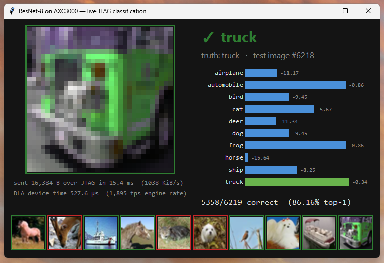

# sw/ph4_jtag_host/

Host-side tooling for the **PH4 Nios-less** builds (the repo's headline result) — imported
verbatim from the second campaign's workspace, the same origin as the `ph4_*` records in
`results/` and the `docs/fpga_ai_*` reports. Distinct from [`sw/host/`](../host/), which is the
PH3 HyperRAM-fed control plane.

| File | Role |
|---|---|
| `run_cifar10_jtag.py` | CIFAR-10 benchmark runner: programs the SOF, drives a JTAG-to-Avalon master via System Console, packs FP16/Cvec inputs, queues DLA jobs, scores logits, and appends one JSON record per image to `<run-dir>/results.jsonl`. Produced the `ph4_*` records. |
| `jtag_worker.tcl` | The System Console worker `run_cifar10_jtag.py` spawns (`system-console --cli --script=...`); line protocol documented in the file header. |
| `live_viewer.py` | Tkinter viewer that tails `results.jsonl` and shows each image being sent over JTAG and classified: pass/fail border, transfer size/time, FP16 logit bars, predicted vs true class, device-time latency, running top-1, filmstrip. Read-only on the run dir — cannot perturb a measurement. |

Measurement discipline matches PLAN §8: reported latency/fps come only from the DLA's
`jobs_active`-gated `CLOCKS_ACTIVE` CSR (device time); JTAG is control/transport and its wall-clock
cost is recorded separately, never as an inference number.

## Usage

The files are kept byte-identical to their origin, so the in-file default paths
(`build/fpga_ai/...`, `fpga/axc3000_mlperf/...`) refer to the origin workspace layout — in this
repo always pass the paths explicitly:

```powershell
# offline end-to-end check, no hardware ('sim' backend)
python sw/ph4_jtag_host/run_cifar10_jtag.py --backend sim --images 200 `
    --dataset <path>\cifar-10-python.tar.gz --run-dir <run-dir>

# real run (AXC3000 on USB Blaster III; needs the PH4 SOF + a config JSON
# with the address map/SOF path — see the Config dataclass in the runner)
python sw/ph4_jtag_host/run_cifar10_jtag.py --backend syscon --images 200 `
    --config <config.json> --dataset <...> --run-dir <run-dir>

# watch it live from another terminal (or --replay 20 on a finished run)
python sw/ph4_jtag_host/live_viewer.py --run-dir <run-dir> --dataset <...>

# headless self-check of the viewer path (decodes + rasterizes every record)
python sw/ph4_jtag_host/live_viewer.py --run-dir <run-dir> --dataset <...> --smoke
```

Requirements: Python ≥ 3.10 with NumPy; Tkinter (standard library) for the viewer window;
Quartus `quartus_pgm` + System Console for the `syscon` backend. The CIFAR-10 python tarball is
fetched per `sw/model_prep/` conventions (not committed).



Validated against the canonical records: `--smoke` over the origin full-10k hardware run
re-derives 8633/10000 = **86.33 %** top-1, matching
[`results/ph4_resnet8-cifar10-niosless-jtag-full10k_20260822.json`](../../results/ph4_resnet8-cifar10-niosless-jtag-full10k_20260822.json);
a fresh 12-image live hardware run (2026-08-24, one programming cycle, zero errors) scored 11/12
with its single miss identical to the canonical run.
